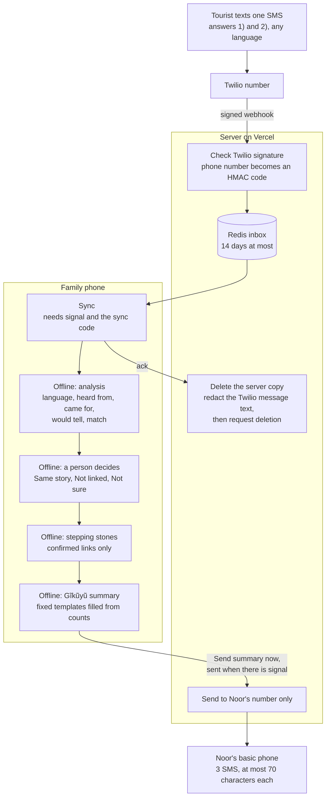
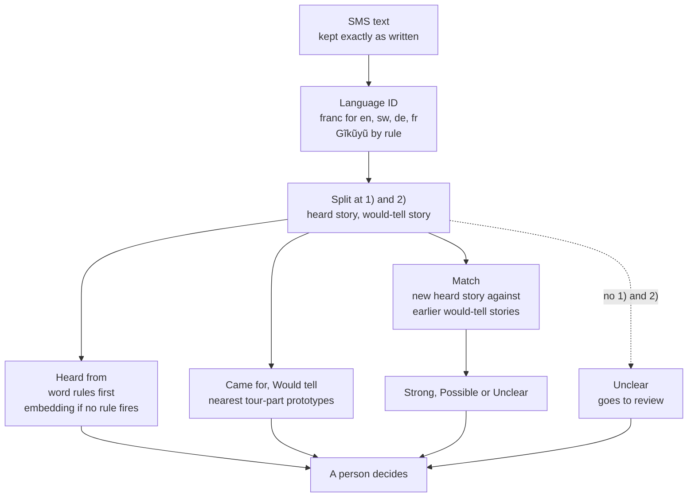

# Stepping Stones

Stepping Stones turns word-of-mouth texts from tourists into a referral map for a small Kenyan coffee farm, analysed offline on the family phone.

- Live demo: https://stepping-stones-plum.vercel.app
- Videos: team, demo and technical walkthrough submitted on HackOS
- Challenge: Hack-Nation x World Bank, Small AI for Development, Track C: Tourism

## Judging criteria and evidence

| Criterion | Weight | Official question | Evidence |
|---|---|---|---|
| The built solution (Small AI fidelity) | 25% | Does the tool work end to end within the constraints of the sector? | Live URL. Real SMS in through Twilio. The Gĩkũyũ summary goes to Noor's number; in the demo a Korean SIM plays her basic phone ([How it works](#how-it-works)). Runs offline after one 162 MB download. Setup, Measure: network requests during the run. Code in [api/](api/), [server/](server/), [src/](src/). |
| Development relevance and impact | 20% | Is this a real problem from the sector briefs, and does the outcome matter to the person it is built for? | [Problem](#problem): the brief's own scenario. Noor learns where visitors heard about the farm and which tour parts they pass on, on the basic phone she carries on the slope. |
| Data grounding | 15% | Does the tool help address an identified gap in the data, is the data modeling sound? | The gap: no record of how word-of-mouth visitors find a farm with no digital presence. Each SMS becomes a structured record on the phone. [docs/DATA_CARD.md](docs/DATA_CARD.md): FLORES-200 dev builds, devtest only reports. Synthetic dev calibrates, synthetic test only reports. A table of what our data does not cover. |
| Evidence it works | 15% | Does the solution fit the challenges identified in the sector, does it add other constraints? | [docs/EVAL.md](docs/EVAL.md): matching top-1 from 13/22 to 20/22, language ID 98.8% to 100% per language, Gĩkũyũ retrieval 97.5% and 98.5% ([Evidence](#evidence)). Adds no new constraint: it uses the phones the household already has, SMS for tourists and Noor, no app on Noor's basic phone, core analysis offline. |
| Clarity, design and inclusivity; value proposition for AI | 15% | What the tool does with AI, and would a simpler tool (SMS, a spreadsheet, a search) do the same job? | Kiswahili-first interface, Gĩkũyũ SMS, one main action per screen. Match strength as a stone glyph plus a word. Lexend font, which draws ĩ ũ Ĩ Ũ. [Why a simpler tool cannot do this](#the-ai). |
| Scalability, replicability and what happens next | 10% | Could another setting reuse this innovation? | [data/operators/noor-coffee.json](data/operators/noor-coffee.json) and [example-guesthouse.json](data/operators/example-guesthouse.json). [Reuse and next steps](#reuse-and-next-steps). |
| Responsible AI, data and safety | Pass / fail | Are the limits respected, and the account of privacy, consent, bias, and human oversight credible? | [Guardrails and privacy](#guardrails-and-privacy): a person confirms every link, Unclear when unsure, bias measured, consent card. [docs/card.md](docs/card.md), [server/hmac.ts](server/hmac.ts), [server/handlers.ts](server/handlers.ts). |

## Problem

> Because of Stepping Stones, Noor will learn every weekend where her visitors heard about the farm and which parts of her tour they pass on, something she otherwise never learns once tourists leave; we know because the brief says her farm is not marketed on a digital platform, six or seven visitors a month find it by word of mouth, and she has no way of knowing what worked once they leave.

From the brief ([docs/CHALLENGE.md](docs/CHALLENGE.md)):

| Fact | Detail |
|---|---|
| No digital marketing | The farm is not marketed on a digital platform. Marketing rarely goes past word of mouth. |
| Word of mouth | Six or seven visitors a month find the farm that way. |
| No feedback | Noor has no way of knowing what worked once visitors leave. |
| Language | Visitors often arrive with a local guide translating. |

Supporting context:

| Fact | Figure | Source |
|---|---|---|
| Website use among registered firms | 51.4% of surveyed establishments (unweighted) have their own website (2018). The survey samples registered firms; an informal farm like Noor's is outside its sample. | World Bank Enterprise Survey, Kenya, via the World Bank Microdata Library |
| Kenyan tourism is large | 2.4 million international arrivals, KES 452.2 billion earnings (2024) | Kenya Ministry of Tourism and Wildlife |
| Women are less often online | 29% less likely than men to use mobile internet in Sub-Saharan Africa (2025) | GSMA Mobile Gender Gap Report |

Full sources and links: [docs/DATA_CARD.md](docs/DATA_CARD.md).

## Try it in two minutes

No phone and no sync code needed. Everything below uses synthetic data.

1. Open https://stepping-stones-plum.vercel.app in Chrome.
2. Tap **English**.
3. Tap **Setup** at the top right.
4. Tap **Load sample history (synthetic)**. 14 made-up past visits load.
5. Tap **Download model**. 162 MB, fetched once, with real progress.
6. Optional: turn off Wi-Fi now. The steps below run offline.
7. Open **Messages**, then **Paste an SMS**.
8. Paste this demo SMS from [data/seed/noor-coffee.synthetic.json](data/seed/noor-coffee.synthetic.json) and tap **Add message**:
   ```
   1) A man staying at our guesthouse told us Noor still has coffee trees her grandmother planted, and that you finish with coffee brewed in a clay pot. 2) Stay for the roasting. Noor roasts the beans in a pan over the fire and you stir them yourself.
   ```
9. Read the review. The SMS bubble sits on top. Under it: Heard from, Came for, Would tell friends about, Language. Beside it: what an earlier visitor would tell friends.
10. Expected: Heard from is Guesthouse guest, and a Strong match with Visitor 1, Sep 2026.
11. Tap **Same story**. A small path replaces the review, and the new stone settles into it. With reduced motion it is drawn in place.
12. Open **Stones**. The stone sits in its path, marked "Most recent link". A "Passed on" line names the tour part that travelled. Tap a stone to read both visitors' words.
13. Open **Noor's SMS**. Read the three Gĩkũyũ SMS. Each shows "SMS 1 of 3" and its character count out of 70. Tap **Show meaning** for English.
14. Sending needs the family's sync code, so the demo stops at the preview.
15. Optional: in **Setup**, under "For demo and judges", tap **Measure**. It runs the model 20 times on a sample message. It shows time per message, network requests during the run, model size, and JavaScript memory where the browser exposes it.

The second demo SMS in the same file works the same way.

## How it works



**The server transports, the device remembers.**

Boxes marked Offline run with airplane mode on. Sync and sending need signal.

Where it sits in Noor's week:

| When | Who | What happens |
|---|---|---|
| During a visit | Tourist | Gets the printed card. Texts one SMS in any language. |
| Any day | Server | Holds the message, 14 days at most. |
| Weekend or any evening, at home | Noor and her daughter | Sync on a data bundle. Check each proposed link. |
| After the check | A person on the family phone | Taps "Send summary now". The phone waits for signal, then sends 3 Gĩkũyũ SMS to Noor's basic phone, about 5 seconds apart. |
| On the slope | Noor | Reads where visitors heard about her and which tour part they pass on. |

## The AI



| Part | What it is |
|---|---|
| Model | Xenova/multilingual-e5-small: int8 ONNX of intfloat/multilingual-e5-small. MIT license. |
| Runtime | Transformers.js on onnxruntime-web wasm, in a Web Worker. |
| Download | 162 MB total: model 118.3, wasm 26.9, tokenizer 17.1. Fetched once on a tap, then cached. |
| Embeddings | Every text gets the "query: " prefix. Mean pooling, normalized. |
| Language ID | franc limited to English, Kiswahili, German, French. Gĩkũyũ by a rule: ĩ and ũ, plus 80 function words from FLORES-200 dev. Short or unsure text is Unknown. |
| Heard from | Fixed word rules in en, de, fr, sw run first. Embedding against referral prototypes only when no rule fires. |
| Came for, Would tell | Similarity to tour-part prototype sentences from the operator config. |
| Matching | New heard story against earlier visitors' would-tell stories. Language-mean centering and ratio margin (Artetxe and Schwenk 2019; k = 4, at most half the candidate pool). |
| Output | Only Strong, Possible, Unclear. No scores on screen. |
| Thresholds | Strong: ratio score at least 1.25, lead at least 0.45. Possible: at least 1.00, lead 0.40. Categories: 0.80, margin 0.005. Set on the synthetic dev split only. [src/ai/thresholds.json](src/ai/thresholds.json) |
| Why a form, spreadsheet or keyword search cannot do this | Free text in many languages has to be connected to earlier free text in other languages. In the sample history, a German visitor heard what an English-speaking visitor would tell. |

## Evidence

All numbers from [docs/EVAL.md](docs/EVAL.md), produced by `npm run eval` on onnxruntime-web wasm, the runtime the phone uses.

### Matching, synthetic test split (40 records)

| Measure | Switches off (plain cosine) | Final (centered plus ratio margin) |
|---|---|---|
| Right earlier visitor ranked first | 13/22 (59.1%) | 20/22 (90.9%) |
| Same language | 6/6 | 6/6 |
| Cross language | 7/16 | 14/16 |
| Strong | 6 right, 0 wrong | 10 right, 1 wrong |
| Possible | 6 right, 8 wrong | 1 right, 1 wrong |
| Ambiguous cases ending Unclear | 2/5 | 4/5 |
| Near misses with a wrong same-language visitor proposed | 2/4 | 1/4 |

### Readings, synthetic test split

| Reading | Right |
|---|---|
| Heard from | 38/40 (95%). 34 decided by word rules, all 34 right. |
| Came for | 11/36 (30.6%) |
| Would tell friends about | 14/36 (38.9%) |

### Language ID, FLORES-200 devtest

| Language | Sentences | Accuracy | Unknown |
|---|---|---|---|
| English | 1012 | 98.8% | 0.8% |
| Kiswahili | 1012 | 99.9% | 0.1% |
| Gĩkũyũ | 1012 | 99.7% | 0% |
| German | 1012 | 99.4% | 0.2% |
| French | 1012 | 100% | 0% |

### Cross-lingual retrieval, FLORES-200 devtest, top-1 of 200

| Direction | Plain cosine | Centered | Centered plus ratio margin |
|---|---|---|---|
| English to Gĩkũyũ | 95.5% | 92.5% | 97.5% |
| Gĩkũyũ to English | 93% | 97.5% | 98.5% |
| English to Kiswahili | 100% | 100% | 100% |
| Kiswahili to English | 100% | 100% | 100% |
| English to German | 100% | 100% | 100% |
| German to English | 100% | 100% | 100% |
| English to French | 100% | 100% | 100% |
| French to English | 99.5% | 100% | 100% |

```
Top-1 retrieval, final setting. Each █ is 5 points.

English to Gĩkũyũ     ███████████████████▌ 97.5%
Gĩkũyũ to English     ███████████████████▊ 98.5%
English to Kiswahili  ████████████████████ 100%
Kiswahili to English  ████████████████████ 100%
English to German     ████████████████████ 100%
German to English     ████████████████████ 100%
English to French     ████████████████████ 100%
French to English     ████████████████████ 100%
```

### Sizes and speed

| Item | Value |
|---|---|
| Download on first tap | 162 MB |
| Model, int8 ONNX | 118.3 MB |
| onnxruntime wasm | 26.9 MB |
| Tokenizer | 17.1 MB |
| Time per SMS-sized text | 36.8 ms median of 50 runs, Mac, Node, wasm, 1 thread |

Galaxy S22, airplane mode: 0 network requests during analysis (Setup, Measure).

## Local language

| Where | Language | Status |
|---|---|---|
| Summary SMS to Noor | Gĩkũyũ | Fixed templates. Machine translation, native-speaker validation pending. |
| App interface | Kiswahili first, English | Chosen on first launch, later in Setup. Kiswahili is machine translation, review pending. |
| Tourist card | English, Kiswahili | [docs/card.md](docs/card.md) |
| Tourist SMS | Any language | Shown exactly as written. Never translated. |

The three summary SMS:

| SMS | Gĩkũyũ template | Meaning shown in the app |
|---|---|---|
| 1 | Noor, kuuma {since}, ageni: {visitors}. Mookire nĩ ũndũ wa ageni a mbere: {referred}. | Noor, since {since}, visitors: {visitors}. Came because of earlier visitors: {referred}. |
| 2 | Maiguire ũhoro mũno kuuma kũrĩ: {top_referral}. | Most often heard about it from: {top_referral}. |
| 3 | Mangĩĩra arata mũno ũhoro wa: {top_pass_on}. | Most would tell friends about: {top_pass_on}. |

Gĩkũyũ against Kiswahili and English:

| Test | Gĩkũyũ | Kiswahili | English |
|---|---|---|---|
| Language ID accuracy | 99.7% | 99.9% | 98.8% |
| Retrieval from English, final | 97.5% | 100% | pivot |
| Retrieval to English, final | 98.5% | 100% | pivot |
| Retrieval from English, plain cosine | 95.5% | 100% | pivot |
| Retrieval to English, plain cosine | 93% | 100% | pivot |

How Gĩkũyũ fares as the less-supported language:

| Gap | What we did |
|---|---|
| No offline language ID library we tested supports Gĩkũyũ; franc labels it Javanese | A rule: ĩ and ũ, plus 80 function words from FLORES-200 dev, tested on devtest |
| Lowest plain retrieval of the five languages | Language-mean centering and ratio margin lift it to 97.5% and 98.5% |
| No Gĩkũyũ prototype sentences | We cannot validate them, so none were written |
| No tourist SMS in Gĩkũyũ tested | Listed in [What our data does not cover](docs/DATA_CARD.md#what-our-data-does-not-cover) |

## Guardrails and privacy

| Guardrail | How | Where |
|---|---|---|
| A person confirms every link | New records start Pending. Only Same story or Not linked changes that. | [src/lib/review.ts](src/lib/review.ts) |
| Unclear when unsure | Low score or small lead over the runner-up gives Unclear. Missing 1) and 2) gives Unclear. | [src/ai/thresholds.json](src/ai/thresholds.json), [src/ai/parse.ts](src/ai/parse.ts) |
| No scores on screen | Strong, Possible, Unclear, as a stone glyph plus the word | [src/components/StoneGlyph.tsx](src/components/StoneGlyph.tsx) |
| No free text generation | Nothing generates text. The AI embeds, compares and picks from fixed lists. | [src/ai/](src/ai/) |
| Fixed templates | Summary SMS are Gĩkũyũ templates filled from counts | [data/operators/noor-coffee.json](data/operators/noor-coffee.json) |
| Phone numbers replaced by a code | HMAC-SHA256 of the sender number. The raw number is never stored or logged. | [server/hmac.ts](server/hmac.ts) |
| Server copy deleted | On sync, or after 14 days at the latest | [server/store.ts](server/store.ts), `POST /api/sync/ack` |
| Twilio message text redacted on sync | Body set to empty, then deletion requested. Verified 2026-10-04: body length 2 before, 0 after. | [server/twilio.ts](server/twilio.ts) |
| Twilio retention | Twilio allows 7 to 400 days. Ours is set to 7, a manual console setting. Backup storage off. | Twilio console, [Twilio data controls](https://www.twilio.com/en-us/blog/new-data-controls-twilio-messaging) |
| Outbound only to Noor | The recipient is always `NOOR_PHONE_NUMBER`. The request cannot set it. | [server/handlers.ts](server/handlers.ts) |
| Sync code stays on the phone | Typed in Setup and stored on the device. Never bundled into the app. | [src/db/settings.ts](src/db/settings.ts) |
| No cloud AI | The model runs in a Web Worker on the phone. Once opened, it cannot fetch from the network. | [src/ai/worker.ts](src/ai/worker.ts) |
| Forged webhooks rejected | Invalid Twilio signature: 403, nothing stored | [server/handlers.ts](server/handlers.ts) |
| Opt-out words not stored | STOP, UNSUBSCRIBE, CANCEL, END, QUIT, STOPALL | [server/handlers.ts](server/handlers.ts) |
| No visitor names | Visitors show as "Visitor 3, Aug 2026" | [src/lib/visitors.ts](src/lib/visitors.ts) |
| Bias: same-language inflation | Measured and corrected with language-mean centering and ratio margin. Near misses with a wrong same-language visitor: 2/4 to 1/4. Cross-language links: 7/16 to 14/16. | [docs/EVAL.md](docs/EVAL.md), [src/ai/language-space.ts](src/ai/language-space.ts) |
| Bias: Gĩkũyũ | Lowest plain retrieval of the five languages (95.5% and 93%). Centering and ratio margin lift it to 97.5% and 98.5%. | [docs/EVAL.md](docs/EVAL.md) |
| Bias: other languages | Word rules and prototypes exist only for English, Kiswahili, German, French. Language ID labels other languages as the closest of those four; in a spot check, Italian came out French and Polish came out Kiswahili. Every reading goes to a person. | [src/ai/language.ts](src/ai/language.ts) |
| Lost or shared phone | Records stay in the phone's browser storage. **Forget sync code** in Setup. Changing `SYNC_TOKEN` on the server and redeploying cuts off a lost phone. | Setup, Vercel environment variables |
| Synthetic data labeled | In file names, `synthetic: true` in records, "Sample, synthetic" in the app | [data/seed/](data/seed/), [data/eval/](data/eval/) |
| Consent | The printed card states purpose, deletion and retention before anyone texts | [docs/card.md](docs/card.md) |

## Limitations

| Limitation | What it means |
|---|---|
| FLORES-200 is clean single-language text | Code-switching and Sheng are not tested at all. |
| Eval sets are synthetic and written by us | 40 records each, by the author of the prototypes and word lists. One record moves a rate by several points. |
| Came for and Would tell are weak | 11/36 (30.6%) and 14/36 (38.9%) on the synthetic test split. |
| Similar text is not proof of a referral | Two visitors can tell the same story on their own. A person decides. |
| 162 MB over 3G takes long | The model is meant to be downloaded once on town Wi-Fi. |
| The demo sends 3 SMS of at most 70 characters | Korean carriers do not join SMS segments; Kenyan carriers do. A Korean SIM plays Noor's basic phone in the demo. |
| Korean carrier filtering | Twilio reported all 3 summary SMS delivered, but the Korean carrier did not display the third one in our tests. Kenyan carriers were not tested. |
| Tourists text a US number | They pay international rates. A Kenyan number would be used in service. Outbound to US numbers is blocked (A2P 10DLC unregistered). |
| Response rate is unknown | No pilot yet. |
| Gĩkũyũ and Kiswahili text need native-speaker review | Summary templates, interface strings, Kiswahili word lists and prototypes are machine translation. |
| Twilio database backups | Twilio states that message bodies may persist in database backups for up to 30 days after a delete request ([Twilio](https://support.twilio.com/hc/en-us/articles/223181008-Twilio-SMS-message-and-traffic-storage)). |
| MMS photos | [Twilio states](https://www.twilio.com/en-us/blog/new-data-controls-twilio-messaging) that deleting a message log also removes its media objects, unless the media is shared with another message. We never store media URLs, and the card does not ask for photos. |
| No app lock on the phone | Anyone with the unlocked family phone can open the records. |
| Language tag for other languages | Text in another language can be tagged English, Kiswahili, German or French. |

## Reuse and next steps

Everything specific to one business lives in one operator config.

| In the config | Noor's coffee farm | Example guesthouse |
|---|---|---|
| File | [noor-coffee.json](data/operators/noor-coffee.json) | [example-guesthouse.json](data/operators/example-guesthouse.json) |
| Business and owner | Noor's coffee farm, Noor | Example Hill Guesthouse, Amina |
| Visit-reason categories | 7 tour parts plus Other and Unclear | 4 parts of a stay plus Other and Unclear |
| Prototype sentences, en sw de fr | 160 | 80 |
| Card questions | English, Kiswahili | English, Kiswahili |
| Summary templates and labels | Gĩkũyũ | Gĩkũyũ |

What a new operator must do:

| Step | Where |
|---|---|
| 1. Name the business and the owner | `display_name`, `owner_name` |
| 2. List the parts of the tour or stay as categories, labels in Kiswahili and English. Keep Other and Unclear. | `visit_reasons` |
| 3. Write prototype sentences for each category in English, Kiswahili, German, French | `visit_reasons[].prototypes` |
| 4. Write the two card questions in English and Kiswahili | `card_questions` |
| 5. Write the summary templates and a label per category. Each SMS fits 70 characters. | `summary_templates` |
| 6. Point the app at the new config and its sample history | [src/operator/active.ts](src/operator/active.ts) |
| 7. Check thresholds. They were set on Noor's synthetic dev split. Write a small dev set and run `npm run calibrate`. | [src/ai/thresholds.json](src/ai/thresholds.json) |
| 8. Run `npm test`. It checks every operator config. | [tests/operator-files.test.ts](tests/operator-files.test.ts) |

Fixed in code, the same for every operator:

| Part | Where |
|---|---|
| Referral categories: Friend/Family, Guesthouse staff, Guesthouse guest, Guide or driver, Social media/online, Other, Unclear | `REFERRAL_SOURCES` in [src/i18n/strings.ts](src/i18n/strings.ts) |
| Referral word rules and prototypes | [data/ai/referral-rules.json](data/ai/referral-rules.json), [data/ai/referral-prototypes.json](data/ai/referral-prototypes.json), [src/ai/referral.ts](src/ai/referral.ts) |
| Model, matching, server, privacy steps | [src/ai/](src/ai/), [server/](server/) |

Changing a referral category is a code change.

What a new local language needs:

| Need | Why | Where |
|---|---|---|
| Summary templates and category labels in that language | The owner's SMS is fixed text | `summary_templates` in the operator config. The field is named `kik` today. |
| A language ID rule | franc has no Gĩkũyũ model, so Gĩkũyũ has its own rule | [src/ai/language.ts](src/ai/language.ts). Function words built like [scripts/build-kik-function-words.ts](scripts/build-kik-function-words.ts). |
| A language mean, if visitors write in it | Matching subtracts each language's mean | `npm run ai:means`, [data/ai/language-means.json](data/ai/language-means.json) |
| An SMS length check | ĩ and ũ make the SMS UCS-2: 70 characters each | [src/summary/summary.ts](src/summary/summary.ts) |
| Native-speaker review | Templates are machine translation until checked | Before the first send |

Next steps:

| Next step | Why |
|---|---|
| Native-speaker review | Gĩkũyũ templates, Kiswahili interface, word lists and prototypes |
| A Kenyan number | Local rates for tourists. Kenyan carriers join SMS segments. |
| Real pilot data | Replace synthetic evaluation. Learn the response rate. |
| Better Came for and Would tell | 30.6% and 38.9% on the synthetic test split |

## Run it yourself

| Command | What it does |
|---|---|
| `npm install` | Installs dependencies |
| `npm run dev` | Vite dev server. `/api` goes to the production deployment. Service worker off. |
| `npm test` | vitest, once, no network |
| `npm run typecheck` | `tsc -b` over app, server, tests and scripts |
| `npm run build` | Typecheck, then `vite build` to `dist/` with the service worker |
| `npm run preview` | Serves `dist/` with the service worker, for offline checks |
| `npm run model:check` | Downloads the model once into `models/`, runs the pipeline on the sample history and demo SMS in Node |
| `npm run eval` | Writes [docs/EVAL.md](docs/EVAL.md) and [docs/eval-results.json](docs/eval-results.json) |
| `npm run calibrate` | Threshold search on the synthetic dev split. Prints suggestions. |
| `npm run ai:means` | Rebuilds [data/ai/language-means.json](data/ai/language-means.json) from FLORES-200 dev |
| `npm run lid:words` | Rebuilds [data/lid/kik-function-words.json](data/lid/kik-function-words.json) from FLORES-200 dev |
| `npm run icons` | Redraws the favicon and app icons |
| `npm run webhook:test -- https://<PUBLIC_BASE_URL>` | Posts a signed fake inbound SMS. Prints only status and MessageSid. |

FLORES-200 for `eval`, `calibrate`, `ai:means` and `lid:words`:

```
curl -L -o data/raw/flores200_dataset.tar.gz https://dl.fbaipublicfiles.com/nllb/flores200_dataset.tar.gz
tar -xzf data/raw/flores200_dataset.tar.gz -C data/raw
```

Environment variables, server only, listed in [.env.example](.env.example):

| Name | Used for |
|---|---|
| `TWILIO_ACCOUNT_SID`, `TWILIO_AUTH_TOKEN` | Twilio API and webhook signature check |
| `TWILIO_PHONE_NUMBER` | The number tourists text |
| `NOOR_PHONE_NUMBER` | The only outbound recipient |
| `SENDER_HMAC_SECRET` | Sender codes |
| `SYNC_TOKEN` | The sync code typed on the phone |
| `PUBLIC_BASE_URL` | Production domain, for the signature check |
| `KV_REST_API_URL`, `KV_REST_API_TOKEN` or `UPSTASH_REDIS_REST_URL`, `UPSTASH_REDIS_REST_TOKEN` | Upstash Redis REST, either pair |

Deploy:

1. Create a Vercel project from this repo. Vite preset, build command `npm run build`. [api/](api/) runs as Node.js functions.
2. Add Upstash Redis from the Vercel Marketplace.
3. Set the variables above in Vercel.
4. In Twilio, set the number's incoming message webhook to `POST https://<production domain>/api/sms/inbound`. Use the production domain: preview URLs sit behind Vercel Authentication.
5. In the Twilio console, set message retention to 7 days (Twilio allows 7 to 400) and turn backup storage off.
6. On the family phone, open the live URL, enter the sync code in Setup, and tap **Download model**.

Stack:

| Layer | Choice |
|---|---|
| App | Vite, React, TypeScript, PWA with vite-plugin-pwa (Workbox) |
| Device storage | IndexedDB via Dexie, persistent storage requested |
| On-device AI | Transformers.js, onnxruntime-web wasm, Web Worker |
| Language ID | franc plus a Gĩkũyũ rule |
| Server | Vercel Node.js functions, Upstash Redis, Twilio Node SDK |
| Font | Lexend, self-hosted |
| Tests | vitest |
